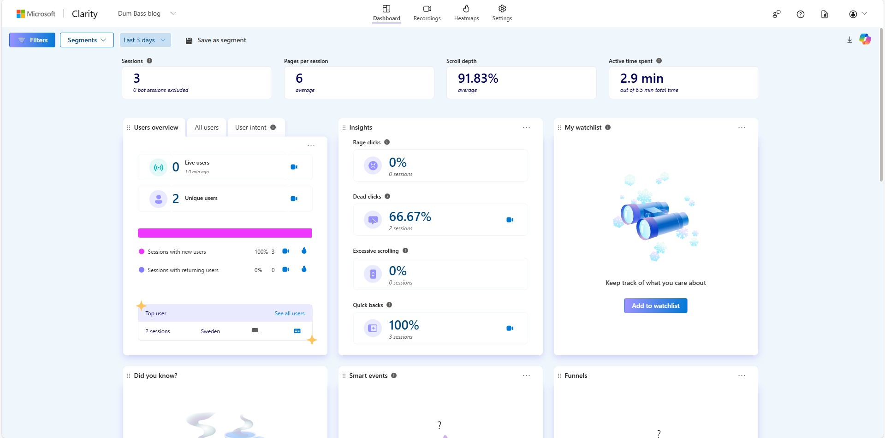
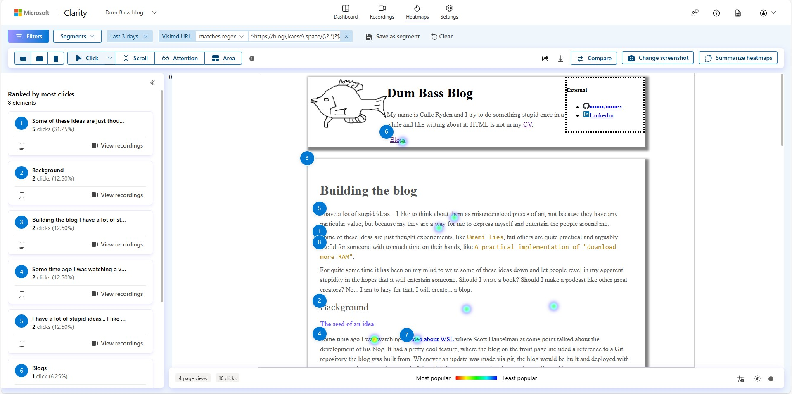
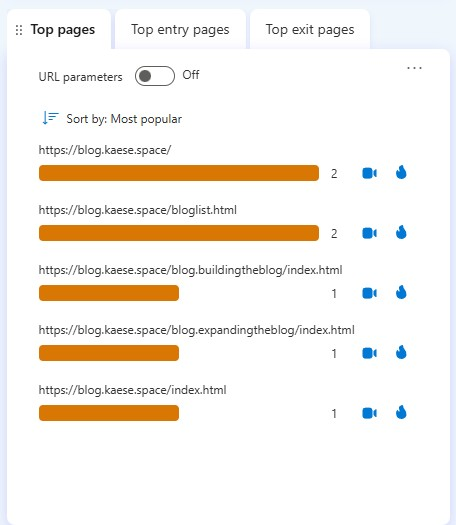

# Analytics, dear Watson!

Let's set the scene... It's 9 o' clock in the morning on a Saturday. I'm sitting in front of the computer, watching
a one year old episode of [Kill Tony with Shane Gillis](https://www.youtube.com/watch?v=XnlmpnfpwoY) while doing some
recreational programming on a [side project](https://github.com/Kaese72/asset-registry). I get a sudden thought that
leaves me perplexed. I look out livingroom window and wonder... is anyone actually reading the blog?

I think I know the answer, but would it not be nice to know for sure that noone is reading the blog. Then I could write
anything on there without the fear of anyone finding out. So lets play around with analytics!

I'm not a big fan of huge corporations, so the first thing I do is google "website analytics tools", which leads me to a 
[YouTube video about website analytics](https://www.youtube.com/watch?v=1cql6CqenEo), which lead me to
[Microsoft Clarity](https://clarity.microsoft.com/). Yes... Independence! /s. I had a thought about self hosting
or developing an analytics solution myself just to learn what its all about, but I decided to go with Microsoft Clarity
before even researching any self-hosted solution, much less trying to develop it myself.

Microsoft Clarity, much like [Google Analytics](https://developers.google.com/analytics), is exceptionally
[easy to setup](https://learn.microsoft.com/en-us/clarity/setup-and-installation/getting-started). Roughly a
three step process.

1. Create an Account
2. Include some random JavaScript on your website
3. Acquire knowledge!

Now... Step #2 did not sit quite right with me. I majored in computer security, and [including some script
from a third party site](https://github.com/Kaese72/dum-bass-blog/commit/dcac574a9147efc4f87320a8388370a4ab0ddca1#diff-f78969d8d3139ada05465e77c0abfd1acc58c3dbc15868eb3e4cc198411e727e) 
feels like inviting a future supply chain vulnerability. Sure, the script is hosted on
Microsoft servers but it would just feel better if the source of that and the analytics engine itself was
controlled by me. For reference, the included script looks like this

    

After taking a quick look at the source code for the script I now pull in dynamicall, I was reminded of my ineptitude with 
Javascript, but based on the functionality it provides it effectively must overlay my entire site, send information to Microsoft
both about the users themselves but also the contents of the site. 

So I logged on to Microsoft Clarity after a while, because apparently it takes a while for them too bootstrap the analytics, and
I am presented with a page that confirms what I already know,

It only shows the two sessions, both are mine from trying out the analytics. I think its pretty cool. I did 
encounter some interesting challenges. In no particular order,

* Microsoft Edge trackin protection prevents their own analytics (pretty cool by Microsoft, blocking their own tracking)
* Adblockers prevents the Clarity script from functioning (duh)
* Local development also shows up as live users (But not on the dashboard?)

But data is flowing in, even though it's pretty limited. Me, myself, and I. The heatmap is pretty cool, but 
not very useful to me at the moment.

What I am mostly interested in is the `Top pages`, which shows me what users are visiting.

Now we wait, and let the data flow in.

//Calle
