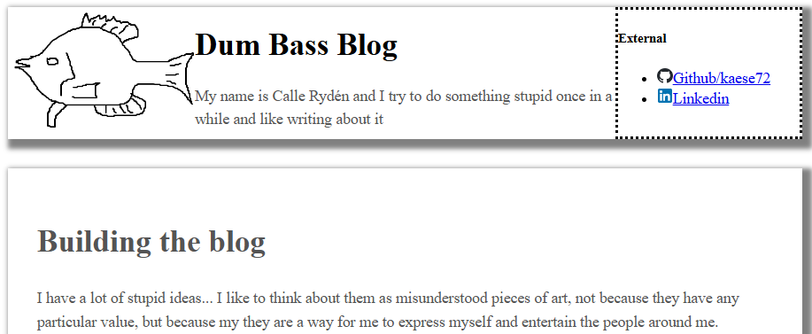
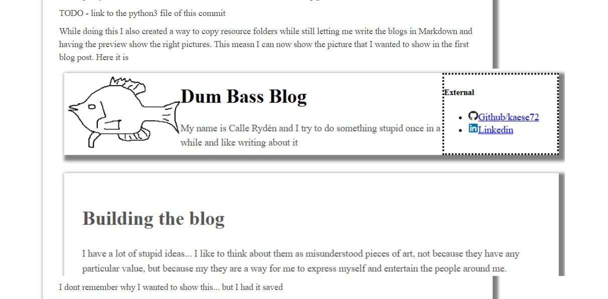

# Expanding the blog

Its been months and the blog looks like crap yet it still has a valid certificate, so I am pretty happy with my efforts.
A few things are still tickling my brain though... I can not include pictures, blog posts are dynamically loaded in via some javascript,
and I only have one blog post. Lets see if we can fix all of that

First of all... the dynamically loading blog posts. I do not really have anything against dynamically loading stuff in, but it did not feel right.
I want a system where I construct the entire blog at build-time and it can then later be loaded in pretty fast. The solution to this... which
initially sounded like a brilliant idea in the depths of my own mind, was to simply template everything and build it all together with a
python script. It is what this blog is now built via, and it works pretty well, but I foresee that it will be unmaintainable if the blog grows.

TODO - link to the python3 file of this commit

While doing this I also created a way to copy resource folders while still letting me write the blogs in Markdown and having the preview show the right
pictures. This measn I can now show the picture that I wanted to show in the first blog post. Here it is

I dont remember why I wanted to show this... but I had it saved so there you go. The first time I included this picture it showed up like this... CSS is awesome!

//Calle
