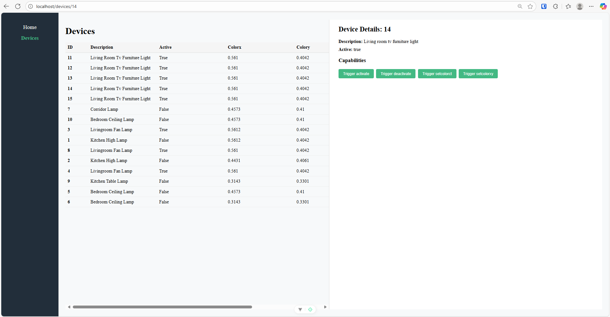

# Vibe coding the blog

I have come to a horrible realization. UI development sucks... To be fair, the problem 
likely resides with me rather than the profession as a whole, because I find UI development
tedious, frustrating, but still incredibly rewarning in the end when I can genuinly see
the results. 

I started this blog because I needed an objective in order to force myself to learn UI 
development. You have seen the results. I would take a compliment any day for my amazing
designs, but I must admit that even though I have learned a lot, I still do not really
enjoy putting in the effort to build the blog or any other UI I might want or need.

Recently I started building a UI for another of my hobby projects, [Huemie UI](https://github.com/Kaese72/huemie-ui).
I had tried doing this before with the same strategy as I had for the Blog. Write everything
from scratch. A *single page architecture* in pure Javascript. No frameworks. 

My hairline is already receding and that project made it worse since I ripped the rest of
my hair out. In order to prevent burnout I decided to start using a framework in an attempt
to alleviate some of the frustrations I had (note: challenge != frustration). 

I started using [Vue.js](https://vuejs.org/) and my salvation had arrived. I really liked how
I could treat the UI as being put together with building blocks, the reactiveness I gained 
practically for free, and scoped styling. Everything made sense again, and I kept on working
for a little while, exploring the framework and the basic functionality I needed to setup
the initial page. However, I realized quite fast that despite using *Vue.js*, it was still
UI development, and while it was a lot easier and more intuitive to me now, I still did
not enjoy it.

There are no pictures from the code I had developed myself (foreshadowing) in my UI project at this point, but it did not look like much. Pretty bare bones and reminded me alot of the blog
with its black/white trivial design. 

Most of the challenges I had had I solved through a combination of tutorials, AI chat, and Code completion powered by [GitHub Copilot](https://github.com/features/copilot). It was slow but I
was making progress. The main problem still persisted. I did not enjoy it. I knew that for the
*Huemie project*, the UI would be the main driver for what I implemented in the backend, so I
would need to keep going, despite the lack of enjoyment in the process.

Most of this (Except for using Vue.js) played out early this spring, and quite frankly, I gave up. 
In order to keep going with the *Huemie project*
I developed [Huemie CLI](https://github.com/Kaese72/device-cli) to debug and control my devices until
I would take up the UI challenge again. 

At this time I had been using GitHub Copilot for code completion, but suddenly VS Code announced that they would
have [support for agent mode in VS code stable](https://code.visualstudio.com/updates/v1_99#_agent-mode-is-available-in-vs-code-stable). It took me a little while to try it out. I started
quite recently and had a great time using it for the backend services. It was quite easy to detect when it
did something weird and fix it since I was familiar with the code it was working in. It felt like telling
someone with slightly less experienced but who had read all available documentation on the internet to 
fix all my issues. I simply sat back, reviewed, made some changes, and kept directing. 

Would I be able to use this in a domain I had very little experience in or patience for? Many months after the
initial failure it was time to pickup the [Huemie UI](https://github.com/Kaese72/huemie-ui) project again. 

It turns out that this was a great choice! I spent this weekend trying out different things and working on basic functionality in the UI. It was not a focused effort, just minor changes in between other tasks I had to take care
of, but what was amazing is that I actually saw more results in a day of barely putting in any effort than
what I got out of focused effort when trying to do it myself. With my limited effort I could guide the 
agent in the direction I wanted to go, and I was able fix some things myself I could not get the agent to
fix on its own. The frustration I had with the agents can be likened to [moving a picture in a word document](https://www.youtube.com/shorts/26BDVgIXkTo), but if I gave it some artistic freedom with rules it had to adhere to it was fine.

And example of this I had when I refactored the blog to use *Vue.js* is with the header, where it kept messing
up the positioning of the menu, so I had to give the agent the rule to follow some ASCII art for the design:

```
----------------------------------
| PICTURE | HEADER               |
| PICTURE | HEADER               |
| PICTURE |                      |
| PICTURE | MENU MENU MENU LINKS |
----------------------------------
```

Once I had managed to convey what I wanted in a way it could process better, it solved the problem pretty
much immediately. 

The *Huemie UI* project was proceeding faster than ever before. Within a few hours I had a rudimentary UI
where I could

* Browse *attributes* of all devices
* Trigger *capabilities* of specific devices



You might look at this and say `I can do better`, and that is probably true, but **I can not**, and I am
fine with that. 99% of all that makes that page look like it does was written by the GitHub Copilot agent,
and I just had to do minor changes I could not make it fix, like margins pushing things in places it should
not be. 

However bad the UI looks, it allowed me to focus on the things I found enjoyable. I started thinking about
new features and how to integrate them with the UI, without getting frustrated with a bunch of UI development. 
I had found a decent balance between quality and effort that allowed me to work on things I enjoyed more. 

So that project is proceeding. A normal human being might have asked someone to help out with the UI 
but that requires human interaction, which is something I only do during working hours `;)`. 

All of this said, I decided to reqrite the blog using *Vue.js* and the Agent, because while I am 
somewhat proud of the rudimental and shitty look of the blog, it is just that... shitty.

This is the result. I have lost some features of the blog which I will need to reintroduce eventually,
like the build Git commit no longer being present, and no automatic building of the RSS feed at build
time, but for now its worth it.

//Calle
